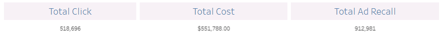
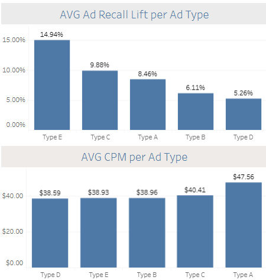
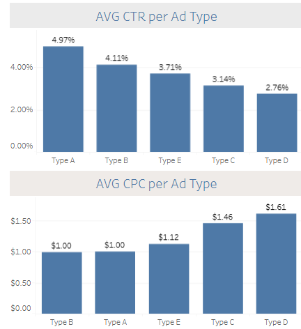

# 🚀 Analyzing Human Resources Data into Dashboard

**Visualization Tool**: [Tableau]([https://public.tableau.com/app/profile/larasati.syarafina/viz/MarketingAnalysisDashboard_17395119448950/Dashboard1?publish=yes])

**Dataset**: [Pacmann - Human Resource Data]([https://](https://github.com/larsyarafina/marketing-analysis/blob/main/Dataset%20study%20case%20dataviz%20digimarketing.xlsx))

## 📌 Dataset
* Data yang digunakan adalah data campaign marketing yang dijalankan perusahaan dari bulan Januari hingga April.
* Data berupa data tabular yang terdiri dari 600 baris dan 10 kolom
* Fitur-fitur yang terdapat pada data ini adalah Date Time, Ad Type, Impression, Reach, Frequency, Engagement, Engagement Rate, Click, Cost, dan Ad Recall.

## 📌 Background
* Perusahaan menemukan data bahwa pada tahun 2016, brand awareness dan traffic generation pada produk telah menurun. Hal ini mengakibatkan konversi penjualan produk menjadi stagnan.
* Dari masalah ini, perusahaan mencoba menjalankan lima tipe ads selama bulan Januari hingga bulan April di tahun 2017 untuk menaikkan awareness dan traffic generation. Perusahaan memiliki batasan cost per mile dalam menampilkan ads sebanyak 1000 kali dengan biaya tidak lebih dari $40.

## 📌 Objectives
* Membuat Marketing Analytics Dashboard untuk mengetahui tipe ads dengan performa terbaik pada tahap awareness dan consideration.
* Memberikan solusi dan rekomendasi untuk memilih ads yang harus dipertahankan dan diberhentikan pada bulan Mei 2017 dan seterusnya yang sesuai dengan batasan cost yang telah diatur oleh perusahaan.

## 📌 Data Analysis
### ✅ Total Perfoma Iklan

Selama bulan Januari hingga April tahun 2017, campaign Ad yang telah dijalankan telah diklik sebannyak 518 ribu kali. Dengan total biaya yang digunakan dalam produksi iklan sebanyak $551.788 dan jumlah Ad Recall sebanyak 912.981.

### ✅ Awareness Analysis

* Untuk meningkatkan brand awareness, metrik yang perlu diperhatikan adalah nilai Cost per Mile (CPM) dan Ad Recall Lift. Semakin tinggi nilai Ad Recall berarti bahwa iklan yang telah dilaksanakan memiliki impresi yang lebih banyak. Sementara untuk nilai CPM, diusahakan dibutuhkan cost minimal dan sesuai dengan alokasi budget yang telah diatur perusahaan.
* Berdasarkan informasi rata-rata Ad Recall Lift dan rata-rata CPM untuk tiap Ad yang diperoleh, diketahui bahwa Ad dengan nilai Ad Recall Lift tertinggi adalah tipe E, disusul dengan tipe C, lalu tipe yang memiliki nilai terendah adalah tipe D.
* Ad dengan nilai CPM terendah sepanjang Bulan Januari hingga Bulan April adalah Ad tipe D lalu tipe E. Sementara Ad dengan nilai CPM tertinggi adalah Ad tipe A.

### ✅ Traffic Generation Analysis

* Untuk meningkatkan traffic generation, metrik yang perlu dipertimbangkan adalah metrik Cost per Clik (CPC) dan Click through Rate (CTR). Persentase rate CTR yang tinggi berarti bahwa iklan ini menjadi tipe iklan yang paling sering diklik audiens. Nilai CPC yang diperhatikan adalah yang memiliki nominal cukup rendah dan sesuai batasan budget namun tetap menghasilkan performa yang efektif.
* Pada metrik CTR, tipe Ad yang memiliki persentase rate tertinggi adalah tipe A, disusul dengan tipe B. Sedangkan Ad dengan persentase terendah adalah tipe D.
* Pada metrik CPC, diketahui bahwa Ad tipe B memiliki rata-rata biaya yang paling rendah, sedangkan tipe D membutuhkan biaya yang paling mahal.

### 💡 Summary
* Dengan mempertimbangkan metrik pada **brand awareness**, yaitu Ad Recall Lift dan CPM, *Ad tipe E* adalah tipe yang direkomendasikan karena memiliki rate Ad Recall Lift tertinggi sebesar 14.94% sehingga lebih efektif untuk meningkatkan brand awareness. Tipe ini juga memiliki cost yang lebih rendah dibanding beberapa tipe Ad lainnya, yakni sebesar $38.93 sehingga lebih cost-efficient.
* Dengan memperhatikan metrik yang relevan untuk meningkatkan **traffic generation**, tipe yang paling direkomendasikan adalah **Ad tipe A**. Tipe ini memiliki tingkat CTR tertinggi, yakni sebesar **4.97%** sehingga menjadi Ad yang paling sering diklik oleh audiens. Tipe ini juga memiliki nilai cost per click yang juga lebih rendah dibanding tipe lain, yaitu sebesar **$1.00 per klik** sehingga lebih hemat biaya namun tetap efektif.
Secara keseluruhan, jika perusahaan ingin memilih tipe Ad dengan memperhatikan keseimbangan antara faktor brand awareness dengan traffic generation, yakni tipe iklan yang memiliki performa Ad Recall tertinggi, CTR tinggi, serta CPM yang lebih rendah dan sesuai dengan batasan cost per mile yang telah ditentukan, maka dapat dipilih *tipe E*.
